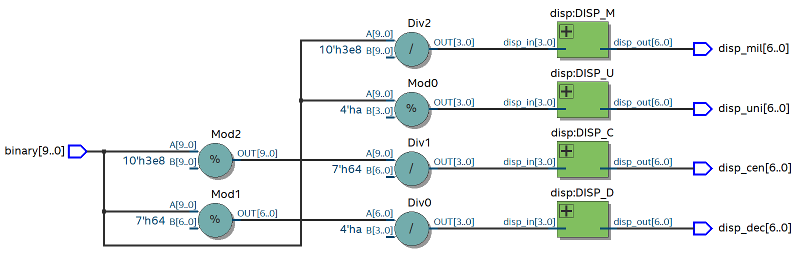
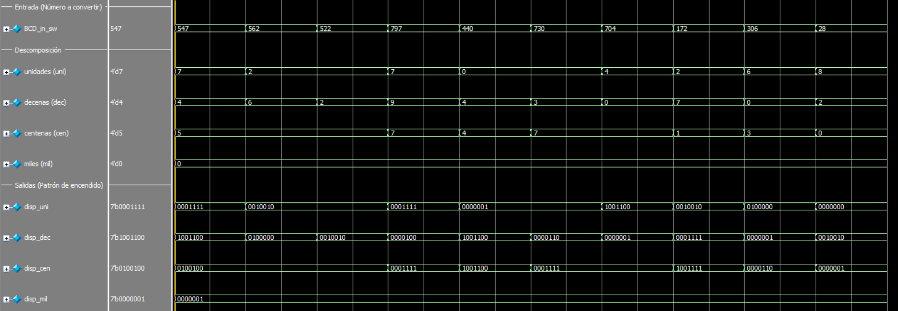
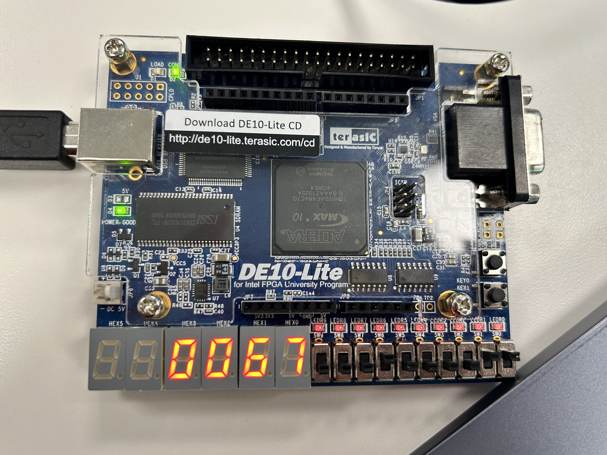

# Práctica 1: Decodificador BCD

## 📌 Descripción

Este proyecto implementa un sistema de visualización en un FPGA utilizando Quartus y Verilog para convertir un valor binario de 10 bits en su representación decimal en displays de 7 segmentos. El módulo principal es "bcd" (archivo "bcd.v").

## ⚙️ Requisitos

Quartus Prime (Intel FPGA)

FPGA compatible (en este caso, se utilizó la tarjeta Intel MAX10 DE10 - Lite)

Cable de programación JTAG

## 📂 Estructura del Proyecto

/01_Decodificador_BCD

│── bcd.v           # Módulo principal que separa la entrada en unidades, decenas, centenas y miles, mandando estos datos a los displays mediante instancias del módulo "disp".

│── disp.v          # Módulo cuya salida es el patrón de encendido de los segmentos de un display de 7 segmentos.

│── bcd_tb.v        # Testbench para simulación. Las pruebas se realizan con números aleatorios.

│── 01_Decodificador_BCD.qpf       # Archivo del proyecto en Quartus.

│── 01_Decodificador_BCD.qsf       # Archivo de configuración del FPGA.

│── README.md       # Este archivo.

## 📸 Imágenes

Diagrama RTL.

Simulación en Questa.

Funcionamiento en la tarjeta especificada en Requisitos.
