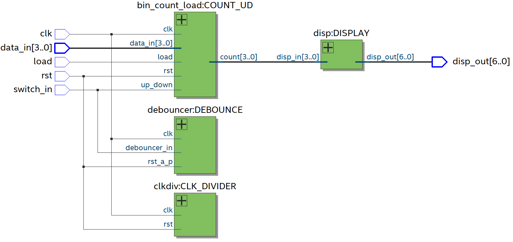

# Counter BCD con clock - up down

## 📌 Descripción

Este proyecto implementa un contador BCD en un FPGA utilizando Quartus y Verilog. El módulo principal gestiona un contador que puede incrementarse o decrementarse, cargar un valor específico y mostrar el resultado en un display de 7 segmentos. Incluye un clock divider, un debouncer, el contador previamente mencionado y el módulo para visualizar la cuenta en el display.

## ⚙️ Requisitos

Quartus Prime (Intel FPGA)

FPGA compatible (en este caso, se utilizó la tarjeta Intel MAX10 DE10 - Lite)

Cable de programación JTAG

## 📂 Estructura del Proyecto

/02_CounterBCD_clk_updown

│── `count_bcd.v`     # Módulo principal.

│── `count_bcd_wr.v`  # Wrapper del módulo principal para asignación de pines.

│── `clkdiv.v`        # Clock divider.

│── `debouncer.v`     # Debouncer.

│── `counter_debouncer.v`   # Módulo auxiliar para el debouncer (instanciado en debouncer.v).

│── `bin_count_load.v`      # Módulo que cuenta hacia arriba y hacia abajo, además de cargar un dato en el contador según las entradas.

│── `disp.v`          # Módulo cuya salida es el patrón de encendido de los segmentos de un display de 7 segmentos.

│── `count_bcd_tb.v`        # Testbench para simulación. El clkdiv y el debouncer se quitaron para simplificarla, evitando retardos innecesarios y facilitando la observación del conteo.

│── `02_CounterBCD_clk_updown.qpf`   # Archivo del proyecto en Quartus.

│── `02_CounterBCD_clk_updown.qsf`   # Archivo de configuración del FPGA.

│── `README.md`       # Este archivo.

## 📸 Imágenes

Diagrama RTL.

Simulación en Questa.

Funcionamiento en la tarjeta especificada en Requisitos.