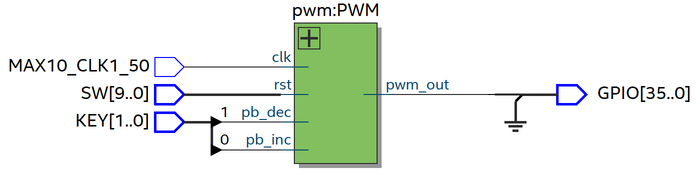
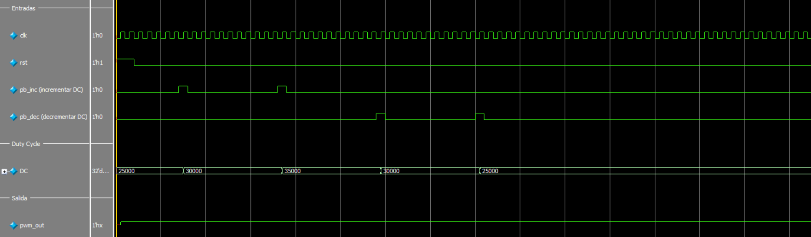

# Práctica 3: PWM

## 📌 Descripción

Este proyecto implementa un PWM para controlar un servomotor en FPGA utilizando Quartus y Verilog. El módulo principal (`pwm.v`) ajusta el duty cycle (DC) mediante botones con debouncer y y un clock divider, generando la señal PWM necesaria para el posicionamiento del servomotor.

## ⚙️ Requisitos

Quartus Prime (Intel FPGA)

FPGA compatible (en este caso, se utilizó la tarjeta Intel MAX10 DE10 - Lite)

Cable de programación JTAG

Servomotor de 9g (en este caso, se usó un SG90)

Jumpers para conectar el servomotor a la FPGA

Archivo `pin_assignment.tcl` para la asignación de pines en el wrapper

## 📂 Estructura del Proyecto

/03_PWM

│── `pwm.v`     # Módulo principal. Modifica el DC y genera la señal PWM de salida.

│── `pwm_wr.v`     # Wrapper del módulo principal para asignación de pines.

│── `pwm_tb.sv`     # Testbench para simulación.

│── `debouncerCclkdiv.v`     # Debouncer para los botones.

│── `d_ff.v`     # Módulo que representa un flip-flop D (auxiliar para el debouncer).

│── `clkdiv.v`     # Clock divider.

│── `03_PWM.qpf`   # Archivo del proyecto en Quartus.

│── `03_PWM.qsf`   # Archivo de configuración de la FPGA.

│── `README.md`       # Este archivo.

## 📸 Imágenes

Diagrama RTL.

Simulación en Questa.

Funcionamiento en la tarjeta especificada en Requisitos.