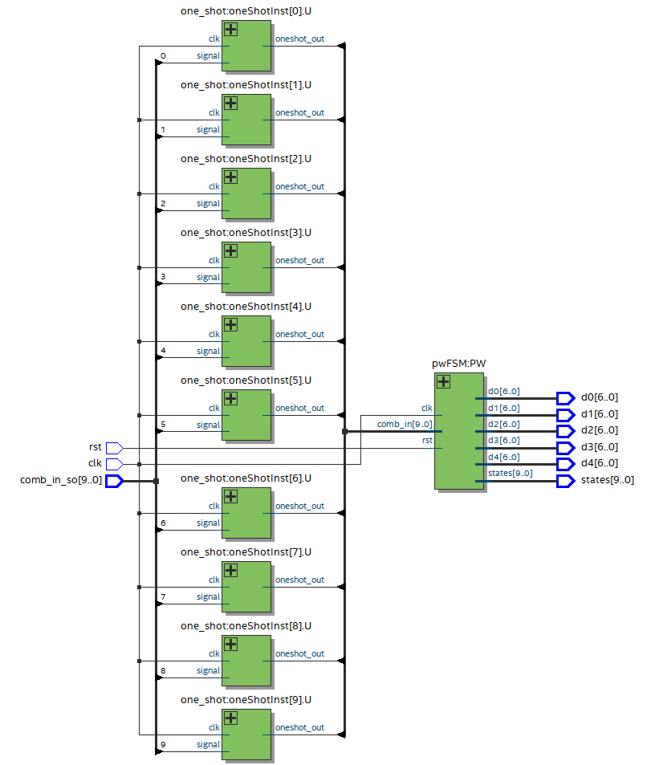
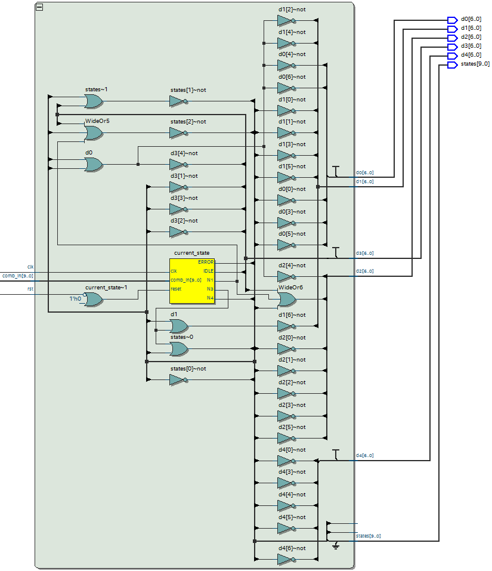
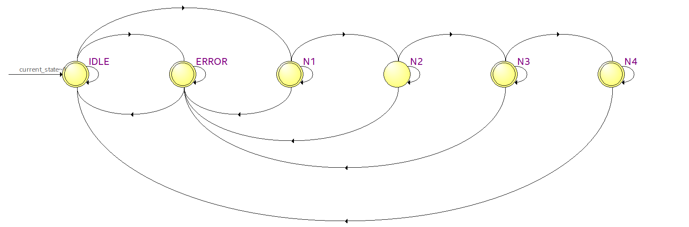
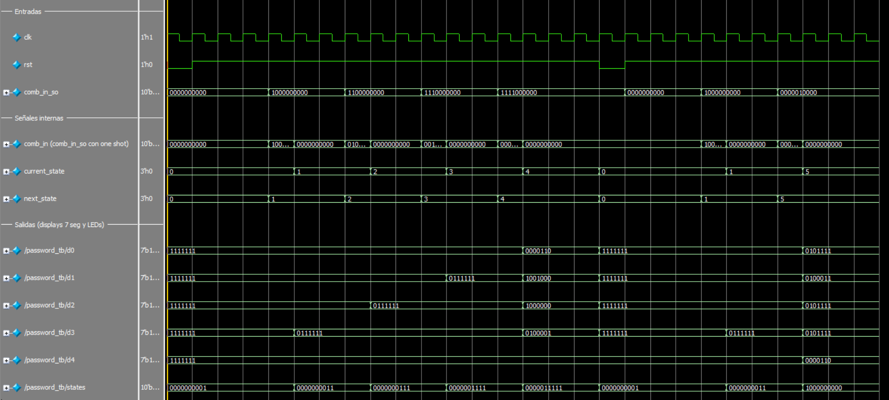

# Práctica 4: Password

## 📌 Descripción

Este proyecto implementa un sistema para introducir una contraseña de 4 dígitos en FPGA utilizando Quartus y Verilog. El módulo principal (`password.v`) utiliza un clock divider y one shot para procesar las entradas, y una FSM para validar la secuencia (9876), mostrando el estado en los LEDs y el resultado ("done" o "error") en displays de 7 segmentos.

## ⚙️ Requisitos

Quartus Prime (Intel FPGA)

FPGA compatible (en este caso, se utilizó la tarjeta Intel MAX10 DE10 - Lite)

Cable de programación JTAG

Archivo `pin_assignment.tcl` para la asignación de pines en el wrapper

## 📂 Estructura del Proyecto

/04_Password

│── `password.v`     # Módulo principal. Contiene instancias a los demás módulos.

│── `password_wr.v`     # Wrapper del módulo principal para asignación de pines.

│── `password_tb.sv`     # Testbench para la simulación.

│── `clkdiv.v`     # Clock divider.

│── `one_shot.v`     # One shot.

│── `pwFSM.v`     # Máquina de estados para evaluar la entrada.

│── `04_Password.qpf`   # Archivo del proyecto en Quartus.

│── `04_Password.qsf`   # Archivo de configuración de la FPGA.

│── `README.md`       # Este archivo.

## 📸 Imágenes

Diagrama RTL.

Diagrama de estados.

Simulación en Questa.

Funcionamiento en la tarjeta especificada en Requisitos.