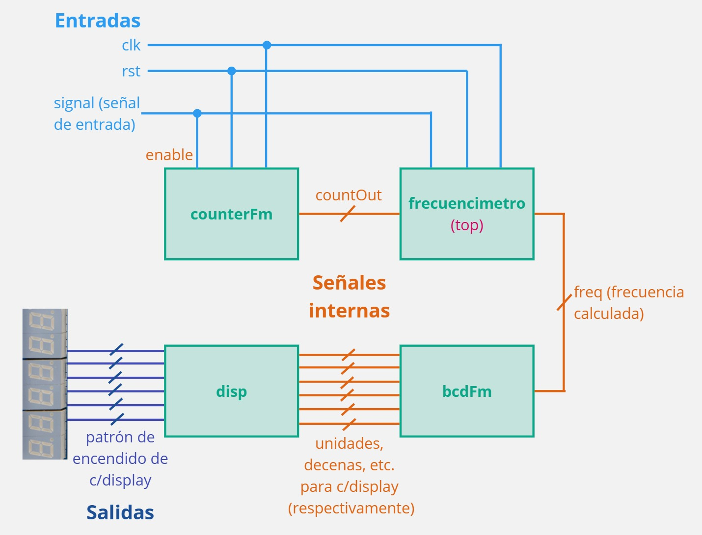
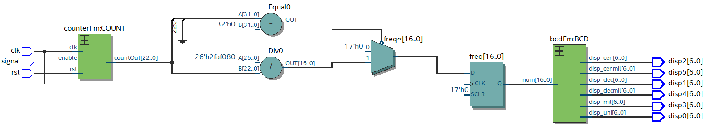
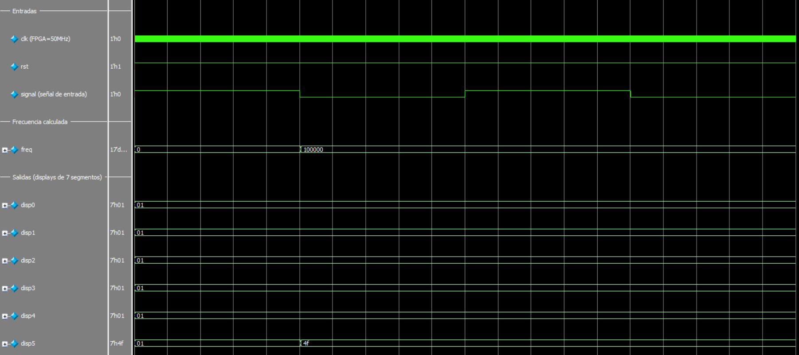

# Challenge 1: Frecuencímetro

## 📌 Descripción

Este proyecto implementa un frecuencímetro en FPGA utilizando Quartus y Verilog. El módulo principal (frecuencimetro.v) utiliza un contador para medir la duración de los pulsos de la señal de entrada, y así calcular la frecuencia y convertirla a BCD para visualizarla en displays de 7 segmentos.

## ⚙️ Requisitos

Quartus Prime (Intel FPGA)

FPGA compatible (en este caso, se utilizó la tarjeta Intel MAX10 DE10 - Lite)

Cable de programación JTAG

Generador de funciones (opcional para pruebas)

Archivo `pin_assignment.tcl` para la asignación de pines en el wrapper

## 📂 Estructura del Proyecto

/Challenge_01_Frecuencimetro

│── `frecuencimetro.v`     # Módulo principal. Utiliza la salida de counterFm para calcular la frecuencia de la señal de entrada.

│── `frecuencimetro_tb.sv`     # Testbench para simulación.

│── `frecuencimetro_wr.v`     # Wrapper del módulo principal para asignación de pines.

│── `counterFm.v`     # Contador que aumenta cuando la señal de entrada es 1. Devuelve ese valor multiplicado por dos para poder considerar un periodo completo de la señal.

│── `bcdFm.v`     # BCD (separa la frecuencia calculada en unidades, decenas, centenas, etc. para poder mostrarla en los displays de 7 segmentos).

│── `disp.v`     # Módulo cuya salida es el patrón de encendido de los segmentos de cada display de 7 segmentos.

│── `Challenge_01_Frecuencimetro.qpf`   # Archivo del proyecto en Quartus.

│── `Challenge_01_Frecuencimetro.qsf`   # Archivo de configuración del FPGA.

│── `README.md`       # Este archivo.

## 📸 Imágenes

Diagrama explicativo de la lógica con la que se calcula la frecuencia.

Diagrama a bloques con los módulos implementados y las señales que intervienen.

Diagrama RTL.

Simulación en Questa.

Funcionamiento con diferentes señales de entrada (50kHz, 100Hz y 100kHz respectivamente) en la tarjeta especificada en Requisitos.