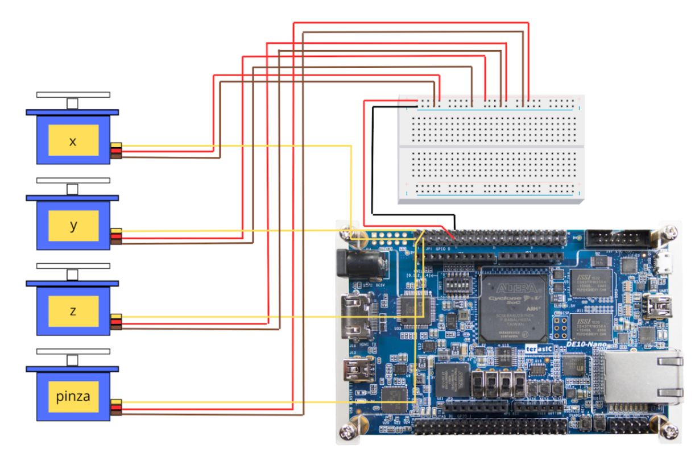
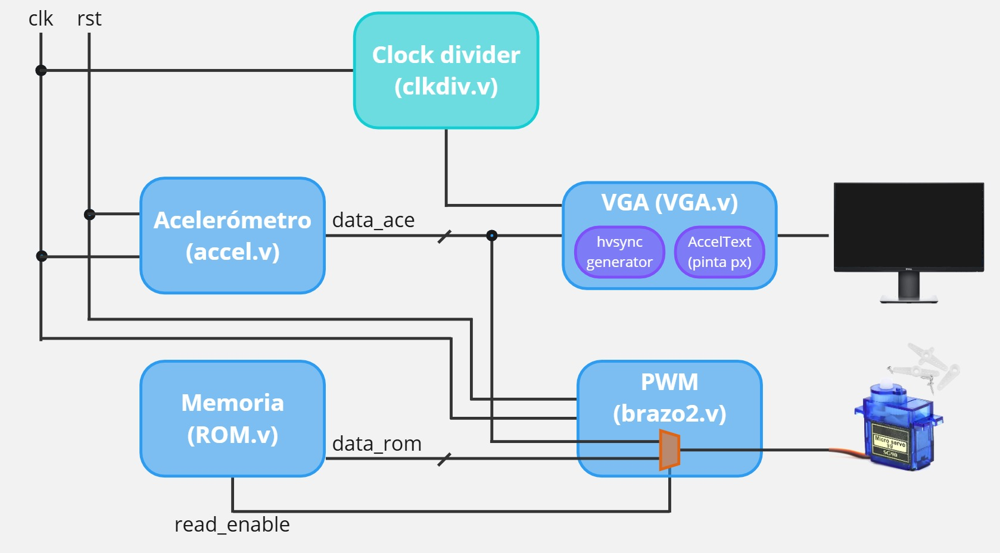

# Proyecto Final: Control de Brazo Robótico con FPGA

## 📌 Descripción
Este proyecto implementa el control de un brazo robótico utilizando una FPGA DE10-Lite con Verilog y Quartus Prime. Se procesan datos de un acelerómetro para generar señales PWM que controlan tres servomotores para los ejes X, Y y Z. Además, se implementa una memoria ROM para ejecutar movimientos predefinidos sin depender del acelerómetro y se utiliza una interfaz VGA para visualizar los datos de este en pantalla.

## ⚙️ Requisitos

Quartus Prime (Intel FPGA)

FPGA Intel MAX10 DE10 - Lite

Cable de programación JTAG

4 Servomotores SG90

Monitor con VGA

Protoboard y jumpers

Archivo pin_assignment.tcl para la asignación de pines en el wrapper

## 📂 Estructura del Proyecto

/Proyecto_Final/Acelerometro

│── `accel.v` # Módulo principal, instancia los demás módulos y gestiona la interfaz VGA.

│── `brazo2.v` # Generación de PWM para controlar los servomotores.

│── `ROM.v` # Memoria ROM con movimientos predefinidos.

│── `VGA.v` # Interfaz gráfica para visualizar los valores del acelerómetro.

│── `clkdiv.v` # Clock divider para generar la frecuencia adecuada para VGA.

│── `hvsync_generator.v` # Sincronización de señales para la salida VGA.

│── `AccelText.v` # Representación de datos del acelerómetro en pantalla.

│── `Acelerometro.qpf` # Archivo del proyecto en Quartus.

│── `Acelerometro.qsf` # Archivo de configuración de la FPGA.

│── `README.md` # Este archivo.

*Para ver la descripción detallada de cada módulo, ver reporte final.

## 📸 Imágenes

Diagrama de conexión de la FPGA con los servomotores y el acelerómetro.

Diagrama de interacción entre módulos internos.

Pruebas con el brazo robótico en funcionamiento (minuto 2:43 a 4:05): https://youtu.be/R5IzqEsoZgw
